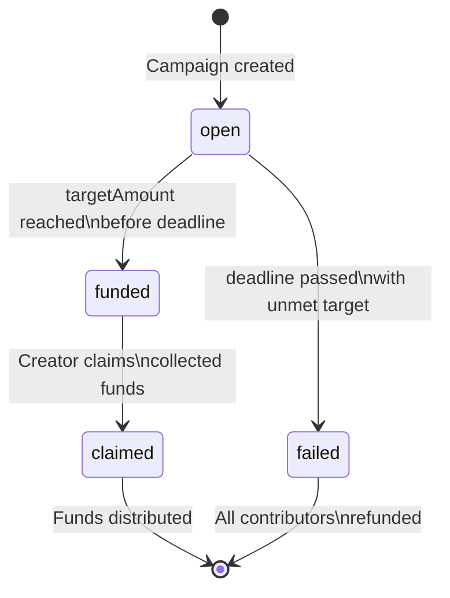

# Campaign Lifecycle State Machine

Stellar Goal Vault implements a deterministic state machine to track campaign lifecycle. Each campaign transitions through a fixed set of states, with guard conditions controlling each transition.

## State Diagram

## States

| State | Description |
|---|---|
| `open` | Campaign is active and accepting pledges |
| `funded` | Campaign reached its `targetAmount` before the deadline |
| `claimed` | Creator has withdrawn the collected funds |
| `failed` | Deadline passed without reaching `targetAmount` |

## Transitions & Guard Conditions

### `open` → `funded`

**Guard:** `pledgedAmount >= targetAmount AND currentTime < deadline`

Triggered when a new pledge brings the total pledged amount to or above the target before the deadline expires. The system automatically transitions the campaign to `funded` upon pledge reconciliation.

**API endpoint:** `POST /api/campaigns/:id/pledges/reconcile`

### `open` → `failed`

**Guard:** `currentTime >= deadline AND pledgedAmount < targetAmount`

A campaign fails when the deadline passes and the pledged amount has not met the target. No explicit API call is needed — status derivation logic (see `calculateProgress` in `backend/src/services/campaignStore.ts`) determines failure automatically.

**Check endpoint:** `GET /api/campaigns/:id`

### `funded` → `claimed`

**Guard:** `msg.sender == campaign.creator AND campaign.status == "funded"`

Only the campaign creator can claim the collected funds. The claim records the on-chain transaction hash and confirms the transfer.

**API endpoint:** `POST /api/campaigns/:id/claim`

## API Cross-Reference

| Endpoint | Method | Effect on State |
|---|---|---|
| `POST /api/campaigns` | Create | Enters `open` state |
| `POST /api/campaigns/:id/pledges` | Pledge | Adds pledge; state unchanged (pending on-chain reconcile) |
| `POST /api/campaigns/:id/pledges/reconcile` | Reconcile | May trigger `open` → `funded` |
| `POST /api/campaigns/:id/claim` | Claim | Transitions `funded` → `claimed` |
| `POST /api/campaigns/:id/refund` | Refund | Refunds a contributor from a `failed` campaign |
| `POST /api/campaigns/:id/soft-delete` | Soft-delete | Hides campaign (data preserved) |
| `GET /api/campaigns/:id` | Read | Returns campaign with derived status |
| `GET /api/campaigns/:id/history` | History | Returns full event log |
| `GET /api/campaigns` | List | Paginated campaign list with filters |

## Contract Events

On-chain integration emits Soroban events that mirror the lifecycle transitions. The MVP currently stores events locally but is designed to be augmented with Soroban RPC event indexing.

| Event Type | Emitted When | Metadata |
|---|---|---|
| `created` | Campaign created | creator, targetAmount, deadline, assetCode |
| `pledged` | Pledge reconciled | contributor, amount, assetCode, txHash |
| `claimed` | Creator claims funds | creator, totalAmount, txHash |
| `refunded` | Contributor refunded | contributor, amount, txHash |

## Backend Event Storage

Events are stored in SQLite table `campaign_events`. Each event includes:
- campaign id
- event type
- timestamp
- actor
- amount
- metadata JSON (includes tx hash, contract ID, ledger number)

## Frontend Usage

The frontend loads `GET /api/campaigns/:id/history` whenever a campaign is selected. This drives the timeline panel so contributors can inspect:
- who created the campaign
- when pledges were added
- when a creator claimed funds
- when a contributor was refunded

## Intended On-Chain Follow-Up

The MVP stores events locally today. The next major contribution should replace or augment this with Soroban RPC event indexing so that:
- local history stays consistent with on-chain activity
- tx hashes and ledger numbers can be displayed
- claim and refund actions can be audited by contributors
