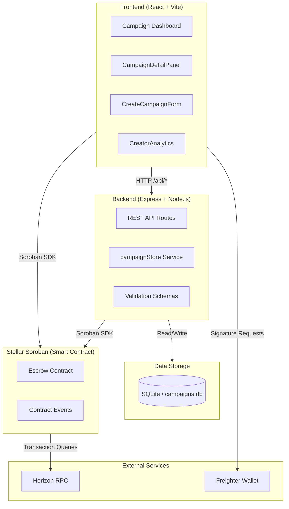
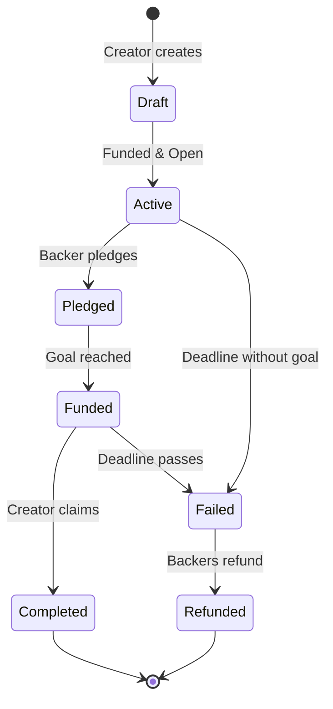
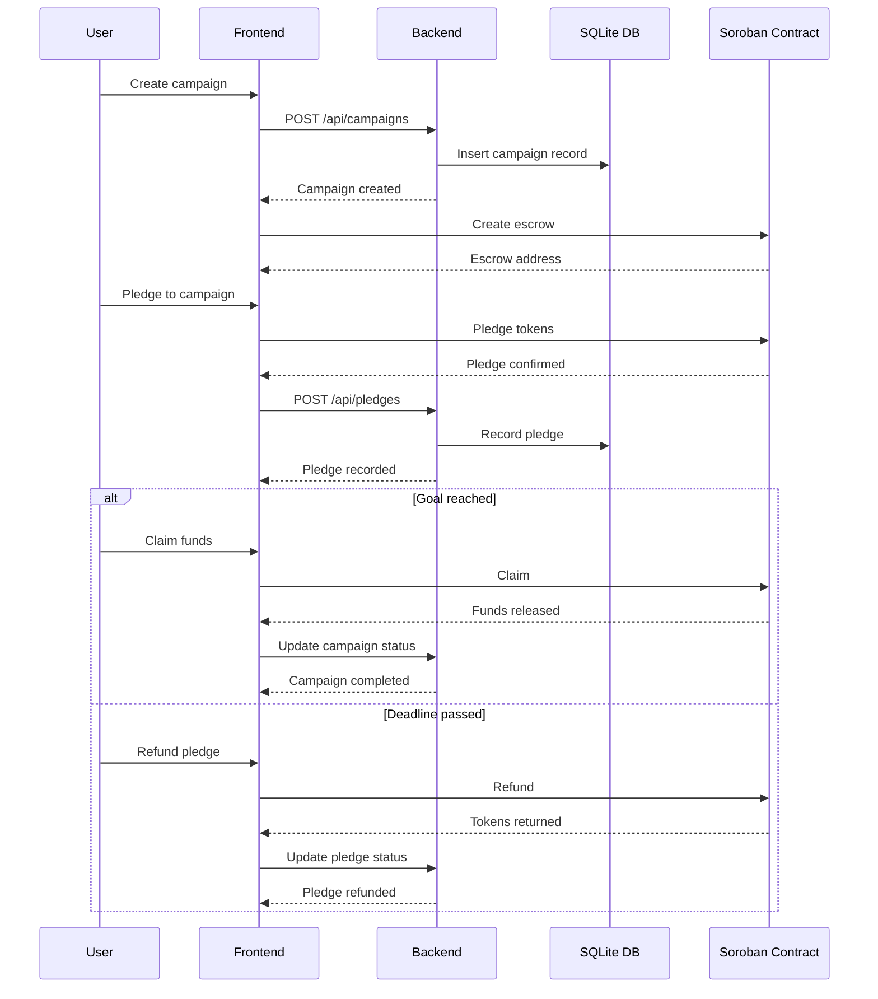

# Architecture

This document describes the system architecture of Stellar Goal Vault, including component relationships and the campaign lifecycle flow.

## System Overview

## Campaign Lifecycle

## Data Flow

## Component Breakdown

### Frontend (`frontend/`)

React + Vite application for creating and managing Stellar crowdfunding campaigns.

| File | Responsibility |
|------|----------------|
| `src/App.tsx` | Main application, routing, state management |
| `components/CampaignDetailPanel.tsx` | Campaign detail view with pledge actions |
| `components/CreateCampaignForm.tsx` | Campaign creation form with validation |
| `components/CreatorAnalytics.tsx` | Creator dashboard with campaign analytics |
| `components/CampaignCard.tsx` | Campaign list card component |
| `components/CampaignsTable.tsx` | Tabular campaign list view |

### Backend (`backend/`)

Express REST API managing campaign state with SQLite persistence.

| File | Responsibility |
|------|----------------|
| `src/index.ts` | Express app setup, routes, middleware |
| `src/services/campaignStore.ts` | CRUD operations, state transitions |
| `src/validation/schemas.ts` | Zod validation schemas |
| `src/logger.ts` | Structured logging |

### Smart Contract (`contracts/`)

Soroban contract implementing on-chain escrow logic.

| File | Responsibility |
|------|----------------|
| `src/lib.rs` | Escrow contract with create, pledge, claim, refund |
| `src/test.rs` | Contract unit tests |

## Tech Stack

- **Frontend:** React 18, TypeScript, Vite, Lucide icons
- **Backend:** Express.js, Zod validation, SQLite (better-sqlite3)
- **Contracts:** Soroban SDK, Rust, Cargo
- **Tools:** Vitest, Playwright, Storybook

## See Also

- [`DEPLOYMENT.md`](./DEPLOYMENT.md) — Production deployment guide
- [`CONTRIBUTING.md`](../CONTRIBUTING.md) — How to contribute
