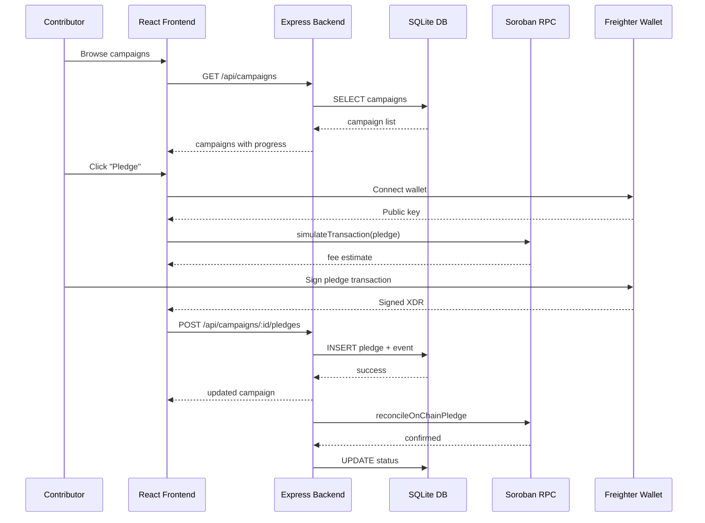
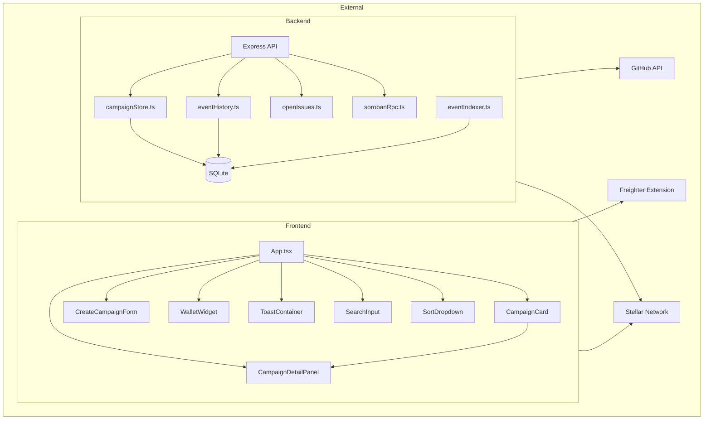
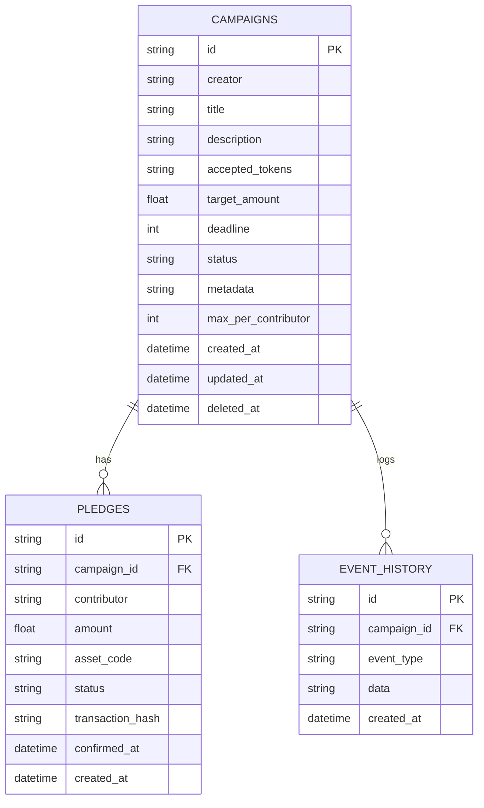

# Architecture

## Sequence Diagram: Pledge Flow

```mermaid
sequenceDiagram
    participant User as Contributor
    participant Frontend as React Frontend
    participant Backend as Express Backend
    participant SQLite as SQLite DB
    participant Soroban as Soroban RPC
    participant Freighter as Freighter Wallet

    User->>Frontend: Browse campaigns
    Frontend->>Backend: GET /api/campaigns
    Backend->>SQLite: SELECT campaigns
    SQLite-->>Backend: campaign list
    Backend-->>Frontend: campaigns with progress

    User->>Frontend: Click "Pledge"
    Frontend->>Freighter: Connect wallet
    Freighter-->>Frontend: Public key

    Frontend->>Soroban: simulateTransaction(pledge)
    Soroban-->>Frontend: fee estimate

    User->>Freighter: Sign pledge transaction
    Freighter-->>Frontend: Signed XDR

    Frontend->>Backend: POST /api/campaigns/:id/pledges
    Backend->>SQLite: INSERT pledge + event
    SQLite-->>Backend: success
    Backend-->>Frontend: updated campaign

    Backend->>Soroban: reconcileOnChainPledge
    Soroban-->>Backend: confirmed
    Backend->>SQLite: UPDATE status
```

## Component Diagram

```mermaid
graph TD
    subgraph Frontend
        App[App.tsx]
        CC[CampaignCard]
        CDP[CampaignDetailPanel]
        CCF[CreateCampaignForm]
        WB[WalletWidget]
        Toast[ToastContainer]
        Search[SearchInput]
        Sort[SortDropdown]

        App --> CC
        App --> CDP
        App --> CCF
        App --> WB
        App --> Toast
        App --> Search
        App --> Sort
        CC --> CDP
    end

    subgraph Backend
        API[Express API]
        CS[campaignStore.ts]
        EH[eventHistory.ts]
        OR[openIssues.ts]
        SR[sorobanRpc.ts]
        EI[eventIndexer.ts]
        DB[(SQLite)]

        API --> CS
        API --> EH
        API --> OR
        API --> SR
        CS --> DB
        EH --> DB
        EI --> DB
    end

    subgraph External
        GH[GitHub API]
        SN[Stellar Network]
        FR[Freighter Extension]

        Frontend --> FR
        Backend --> GH
        Backend --> SN
        Frontend --> SN
    end
```

## Data Flow: SQLite Schema

```mermaid
erDiagram
    CAMPAIGNS {
        string id PK
        string creator
        string title
        string description
        string accepted_tokens
        float target_amount
        int deadline
        string status
        string metadata
        int max_per_contributor
        datetime created_at
        datetime updated_at
        datetime deleted_at
    }

    PLEDGES {
        string id PK
        string campaign_id FK
        string contributor
        float amount
        string asset_code
        string status
        string transaction_hash
        datetime confirmed_at
        datetime created_at
    }

    EVENT_HISTORY {
        string id PK
        string campaign_id FK
        string event_type
        string data
        datetime created_at
    }

    CAMPAIGNS ||--o{ PLEDGES : has
    CAMPAIGNS ||--o{ EVENT_HISTORY : logs
```
