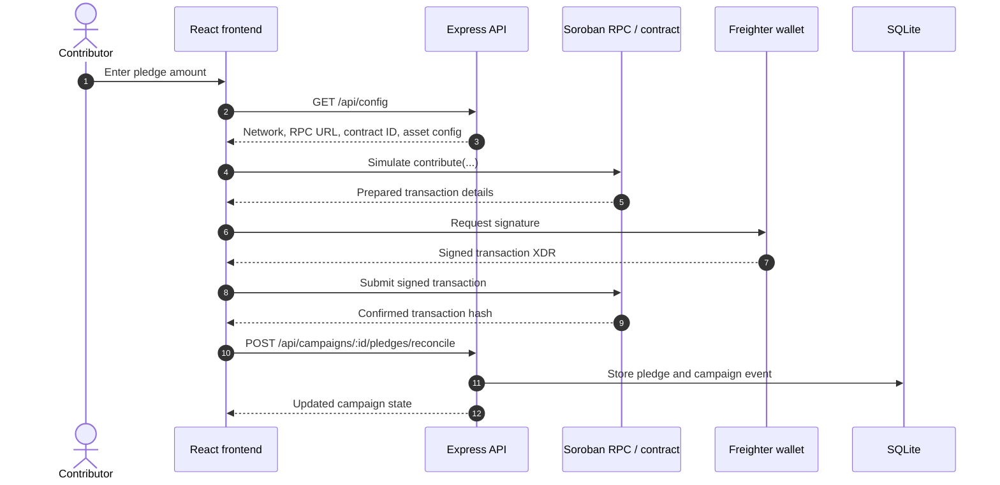
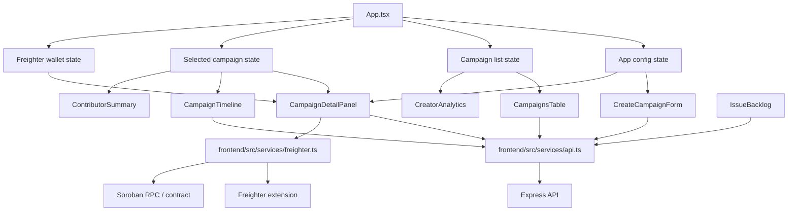
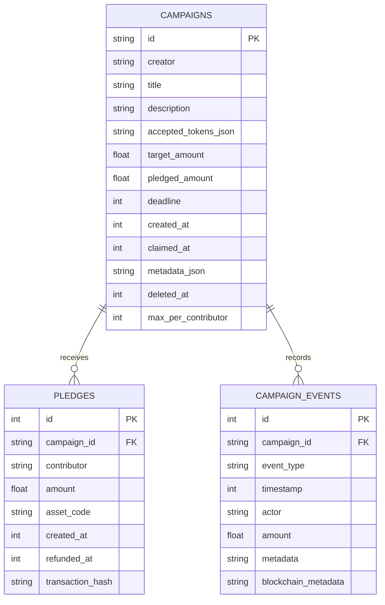

# Architecture Diagrams

These diagrams summarize the current Goal Vault MVP shape: a React frontend, an
Express API, SQLite persistence, and the Soroban/Freighter pledge path.

## Pledge Flow

## Frontend Components

## SQLite Data Flow

`campaigns` holds the campaign metadata and aggregate funding state. `pledges`
stores contributor-level amounts, assets, refund markers, and confirmed
transaction hashes. `campaign_events` keeps the local timeline, including
on-chain reconciliation metadata when it is available.
