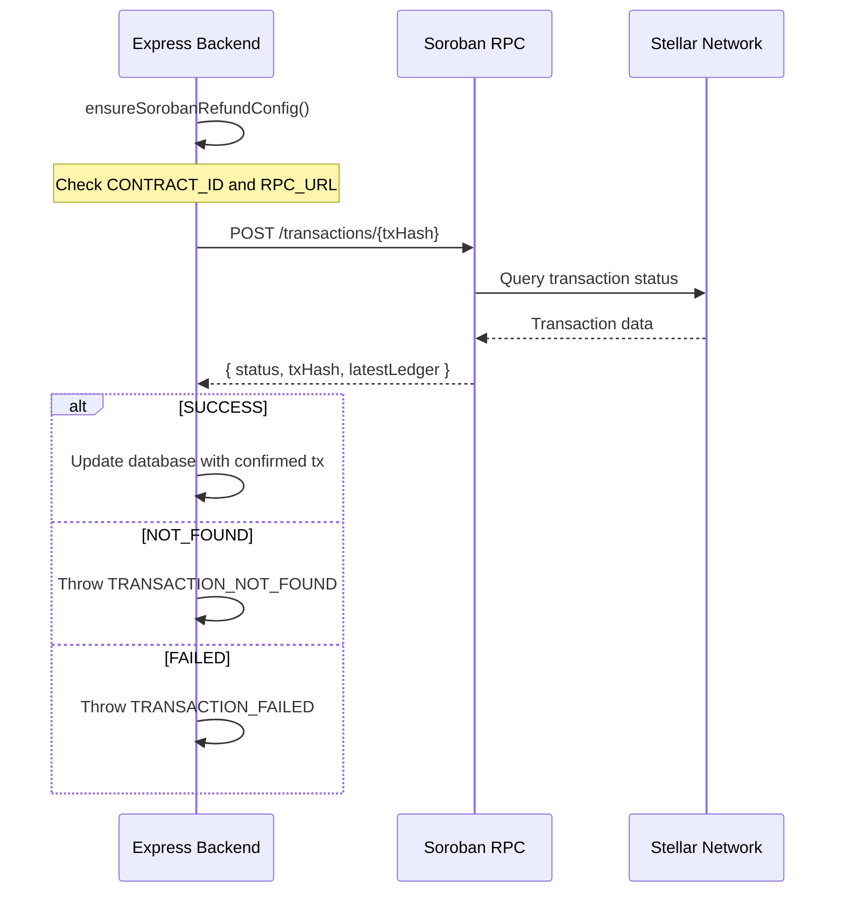

# Soroban RPC Interaction Patterns

This document explains how the backend interacts with Soroban RPC for transaction simulation, signing, and reconciliation.

## Overview

The Soroban RPC flow follows this pattern:

1. **Simulate** — The frontend calls `simulateTransaction` to estimate fees and validate the transaction
2. **Sign** — The user signs with Freighter wallet
3. **Submit** — The signed XDR is submitted to the Soroban RPC
4. **Reconcile** — The backend verifies the on-chain result and updates the database

## Key Functions

### `ensureSorobanRefundConfig()`

Guards that the Soroban configuration (`CONTRACT_ID`, `SOROBAN_RPC_URL`) is present before making RPC calls. Throws a `503 SOROBAN_REFUND_NOT_CONFIGURED` error if the contract ID is missing.

### `verifyRefundTransaction(txHash)`

Queries a Soroban RPC node to confirm a refund transaction succeeded on-chain.

**Parameters:**
- `txHash` (string): 64-character hex string of the Soroban transaction hash

**Returns:**
```typescript
{
  txHash: string;       // Verified transaction hash
  status: "SUCCESS";    // Only returns on success
  ledger?: number;      // Ledger sequence number
  createdAt?: number;   // Unix timestamp
  latestLedger: number; // Latest ledger at verification time
}
```

**Error conditions:**
- `SOROBAN_REFUND_NOT_CONFIGURED` (503) — contract ID not configured
- `SOROBAN_RPC_NOT_CONFIGURED` (503) — RPC URL not configured
- `TRANSACTION_NOT_FOUND` (404) — transaction not found on chain
- `TRANSACTION_FAILED` (400) — transaction found but not in SUCCESS status

## Why Simulation Is Required Before Signing

Stellar Soroban requires transaction simulation before signing because:
1. The network must determine the resource footprint (CPU instructions, memory, IO)
2. The fee is calculated based on the simulated resource usage
3. The `sorobanData` footprint returned by simulation must be included in the signed transaction

Without simulation, the transaction would be rejected by the network.

## Known Error Codes

| Code | HTTP Status | Meaning |
|------|-------------|---------|
| `SOROBAN_REFUND_NOT_CONFIGURED` | 503 | Contract ID is not set in environment |
| `SOROBAN_RPC_NOT_CONFIGURED` | 503 | RPC URL is not configured |
| `TRANSACTION_NOT_FOUND` | 404 | Transaction hash does not exist on chain |
| `TRANSACTION_FAILED` | 400 | Transaction exists but failed |

## Architecture


